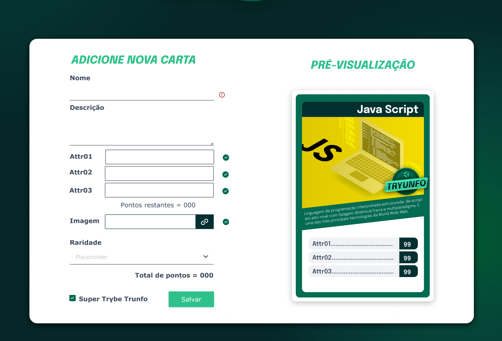
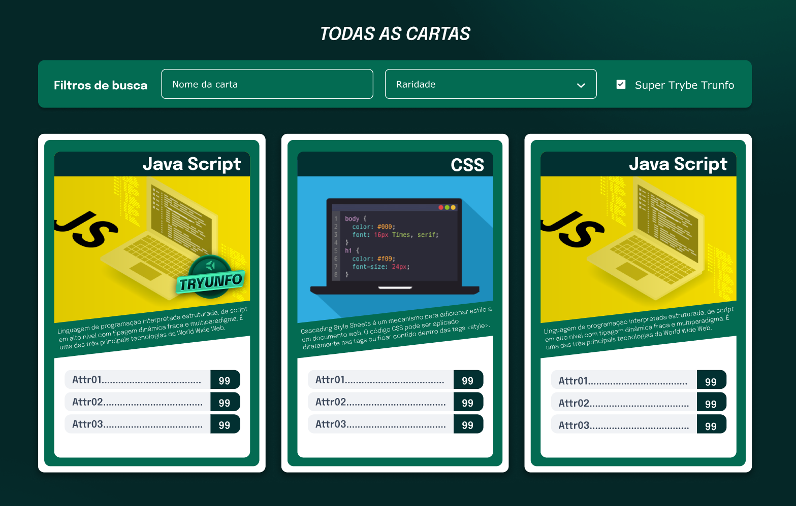
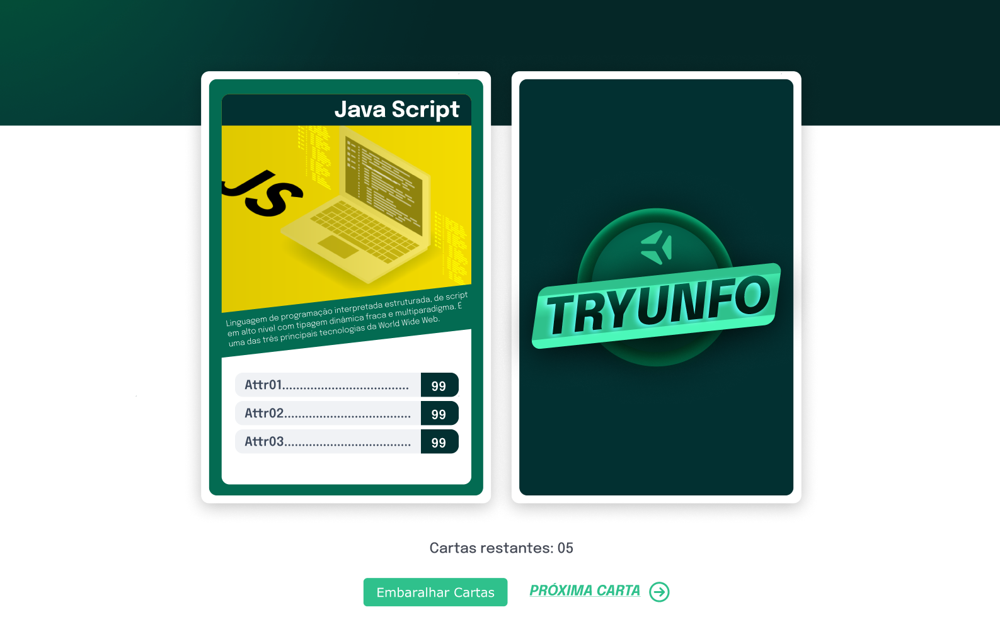

# Boas-vindas ao repositório do projeto Tryunfo!

Seja muito bem-vindo(a) ao repositório do Projeto Tryunfo Aqui você encontrará informações sobre o que foi desenvolvido neste projeto, bem como os principais aprendizados adquiridos durante o processo, para adquirir esse conhecimento, basta clicar na seta abaixo que o conteúdo se abrirá, boa leitura, espero que goste. 🙂

 

  
<strong>👨‍💻 O que foi desenvolvido</strong>
 

  Neste projeto foi desenvolvido um jogo no estilo Super Trunfo! Ao utilizar essa aplicação a uma pessoa usuária é capaz de:

  * Criar um baralho com o tema livre;

  * Adicionar e remover uma carta do baralho;

  * Visualizar todas as cartas que foram adicionadas ao baralho;

  * Jogar com o baralho criado.

 

  
<strong>Habilidades desenvolvida neste projeto</strong>
 

  Neste projeto, eu fui capaz de:

  * Ler o estado de um componente e usá-lo para alterar o que exibimos no browser

  * Inicializar um componente, dando a ele um estado pré-definido

  * Atualizar o estado de um componente

  * Capturar eventos utilizando a sintaxe do React

  * Criar formulários utilizando sintaxe JSX com as tags: `input`, `textarea`, `select`, `form`, `checkbox`

  * Transmitir informações de componentes filhos para componentes pais via callbacks

 

 
 

 
 
